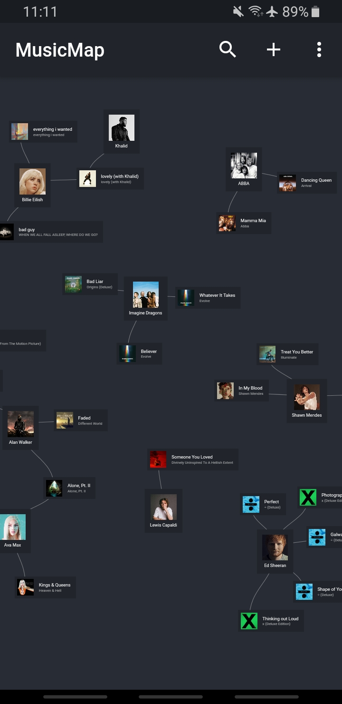
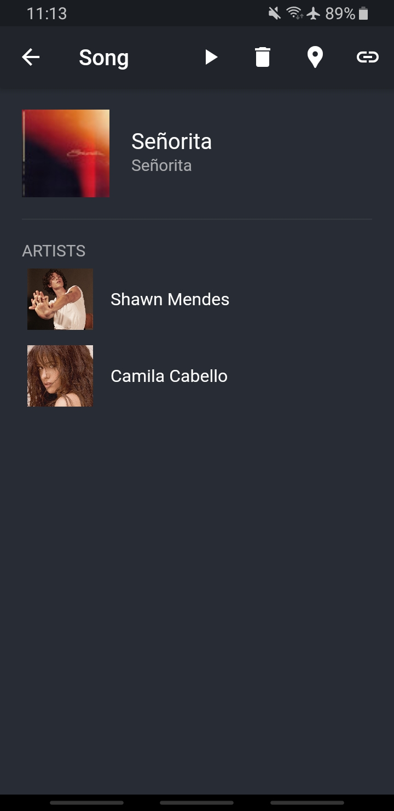
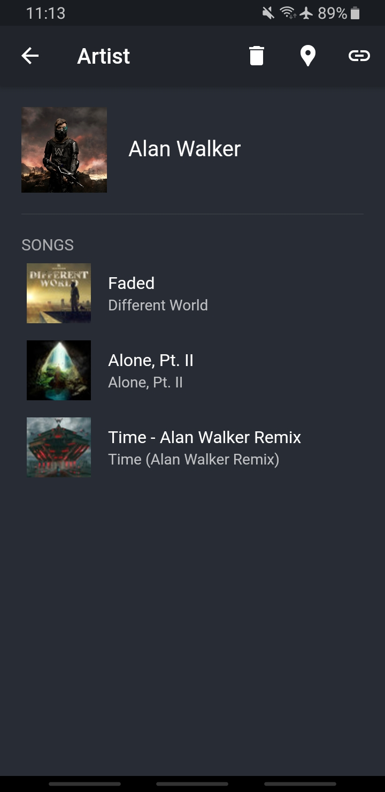
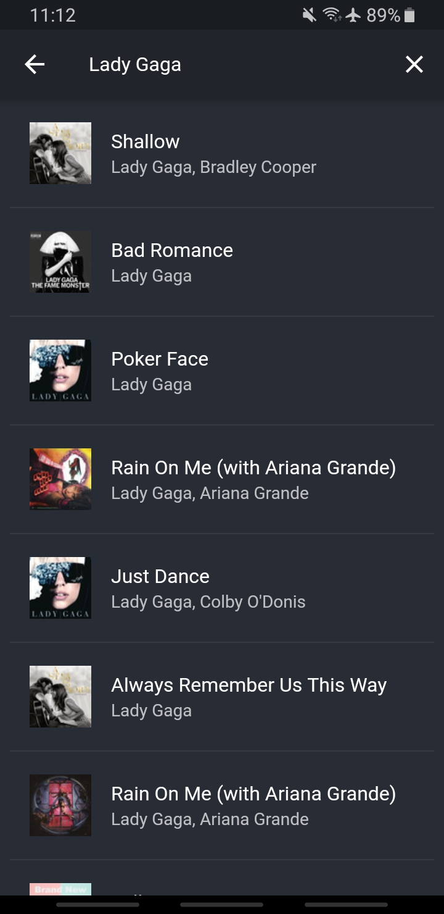
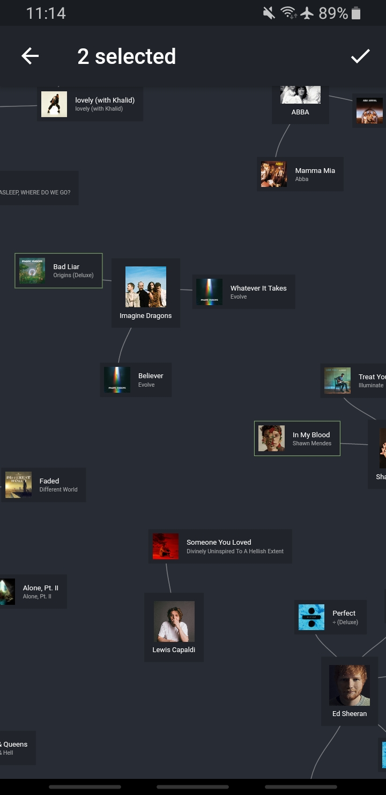
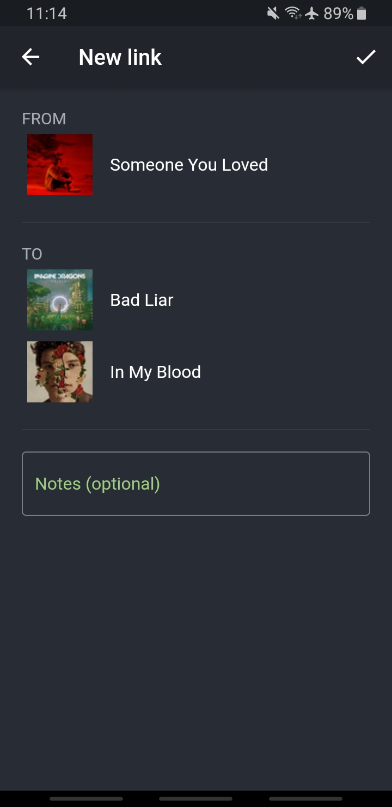
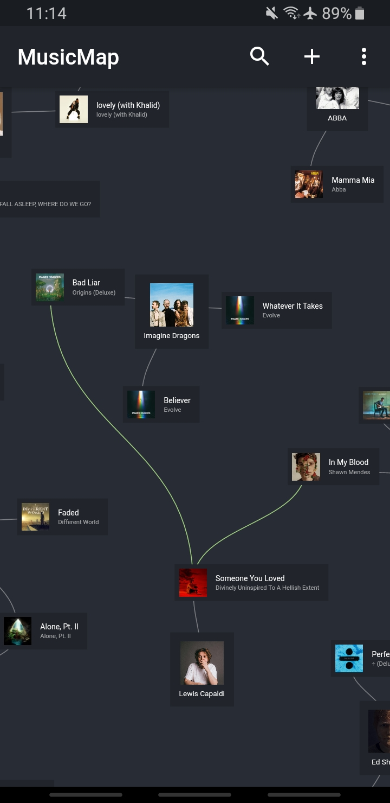
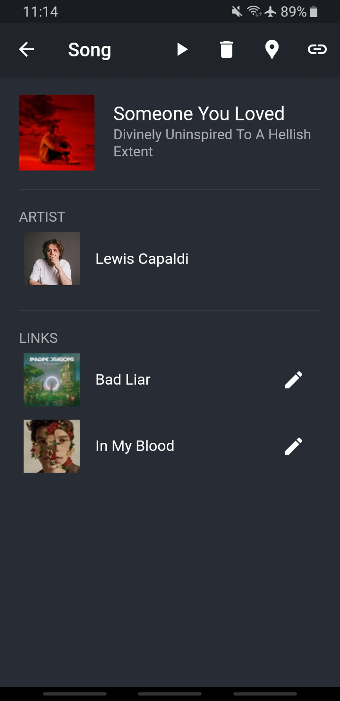
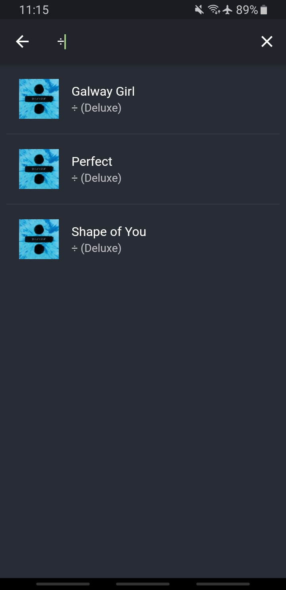

# MusicMap

An app for arranging your favorite songs and artists in a visual way on a map.

## What does it look like?

  
  
  

## How does it work?

This app uses the [Flutter](https://flutter.dev/) framework to easily compile to iOS and Android.

It also uses the [Spotify API](https://developer.spotify.com/documentation/web-api/) when searching for songs. The response from the API contains information about the artist, the album and the song, including the images.

When adding a song, the data is stored in a local SQLite database. A node on the map is created for every stored song and artist which are connected by lines to represent their relationship.

You can easily rearrange the nodes on the map by simply dragging them around.

## Custom links between songs / artists

The actual idea behind this map is the ability to add custom links / connections between nodes with optional notes. This way, you may easily visualize correlating songs or artists; or whatever you want...

    
    
    
    

## Additional features

If you're searching for a song / artist but can't find it on your map due to too many nodes, then there's a search menu where you can simply search for songs, artists and albums to quickly find them. In the song / artist menu, there's a "find location button" which navigates directly to the node on the map.

